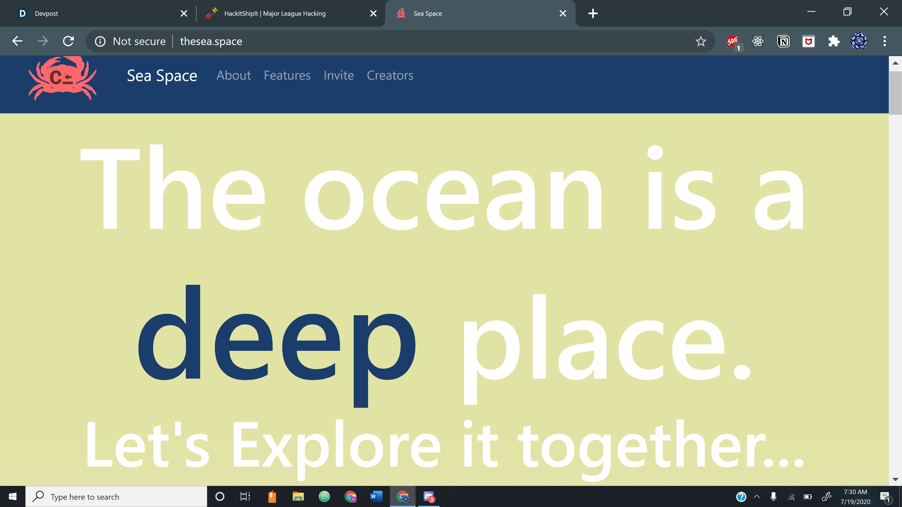
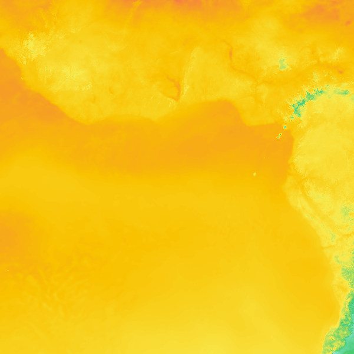

Sea Space is the first ever ocean-centric discord bot, aimed at education and entertainment for all your oceanic needs. Users can easily access ocean satellite images, directions, and more.

## Inspiration
Discord bots can make learning about any topic more fun and easy. This is why we decided to make a bot that is focused on educating the public about the ocean.

## What it does
Our discord bot, named Sea Space, is designed to be playful and friendly. It is equipped with 5 main features:
* **Sea Stats**. This command utilizes the Meteomatics API to find information about the ocean given a coordinate, such as temperature, salinity, and depth. Users can also request a satellite image over an area that displays the temperature as a heat map
* **Sea Spot**. This command calculates the coordinates of a location and can determine whether the location is on land or on the sea. If the location is on land, Sea Space will give directions to the nearest ocean.
* **Sea Size**. This command returns constant value information about the ocean, like its volume or mass. However, Sea Space can easily convert between units, allowing users to understand how large the ocean is in everyday measurements like cups
* **Sea Species**. This feature will activate whenever Sea Space detects an image being uploaded. Using TensorFlow, the bot can run a Keras Convolution Neural Network in order to classify sea animals that may appear in these pictures
* **Sea Support**. No bot is complete without a help command. Sea Support will list all the commands, as well as the format for properly calling them

## How we built it
We used the popular python API **discord.py**. Once we had a basic bot structure, we integrated a machine learning model, built with the **VGG16** architecture, to run our Sea Species feature.

After this, we implemented several APIs, like **Meteomatics** and **Opencage**, in order to access information about the ocean at a moments notice. We integrated all of these into python modules in order to function as the commands.

We designed a website where users who are interested in inviting Sea Space into their own Discord servers.
Finally used **Google Cloud** to host our website, as well as run Sea Space, through an Apache server. 

We made a public discord for anyone who is interested in testing the bot.
## What's next for SeaSpace
There are more features coming to SeaSpace including:
* Sea Song, a way to play all your favorite ocean themed songs
* Sea Scene, a function that displays dazzling sea images of a given area
* Sea Soothe, a shortcut to relaxing sea tunes
